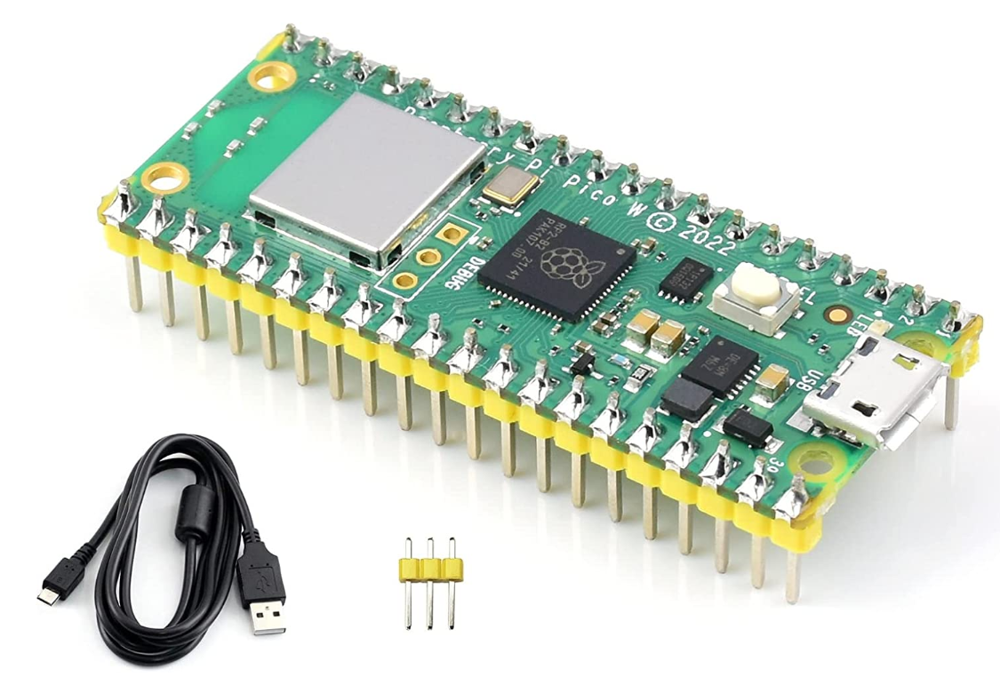
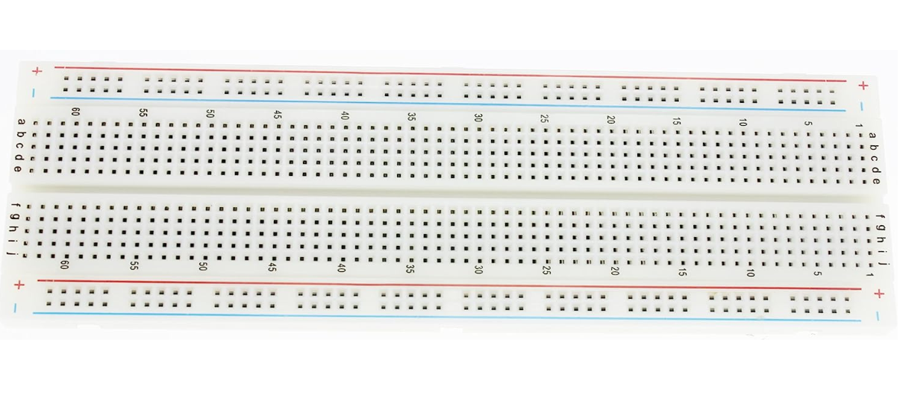
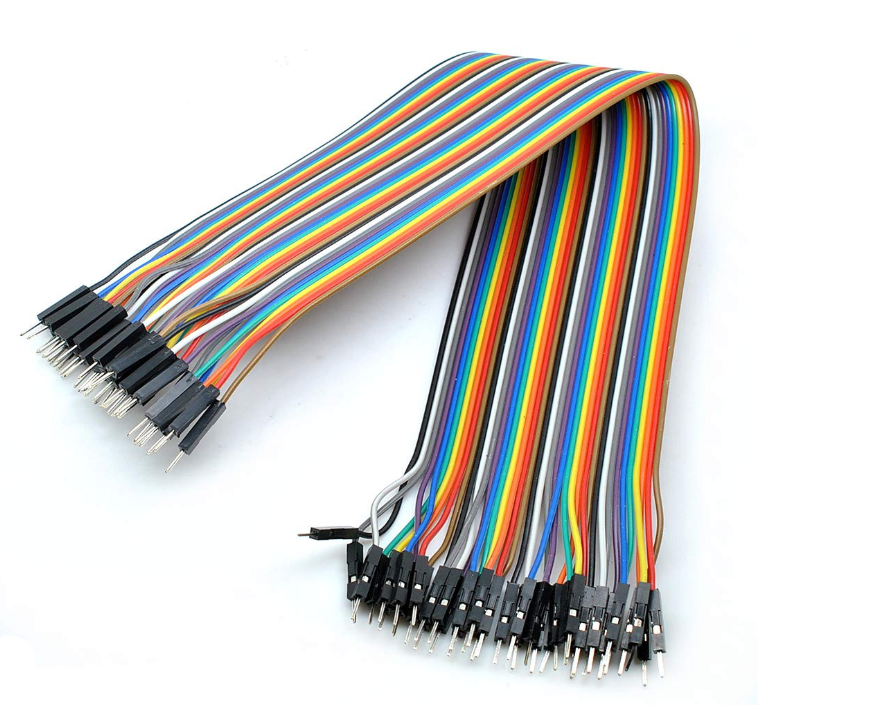
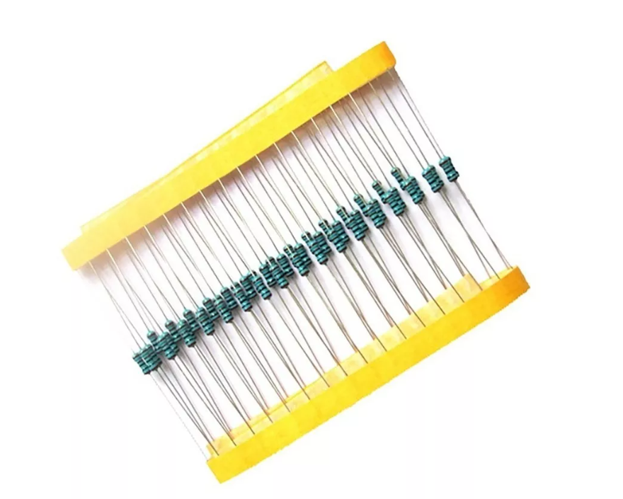
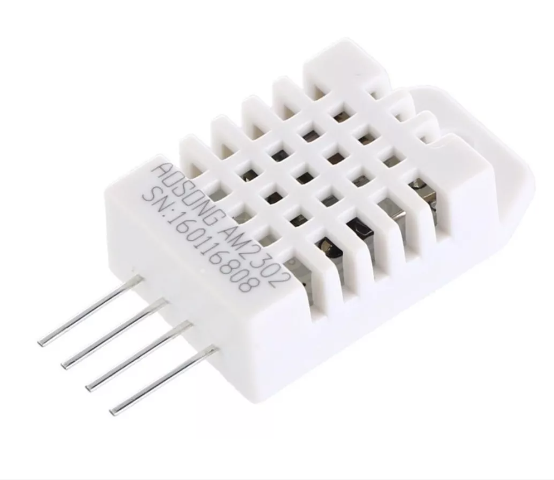
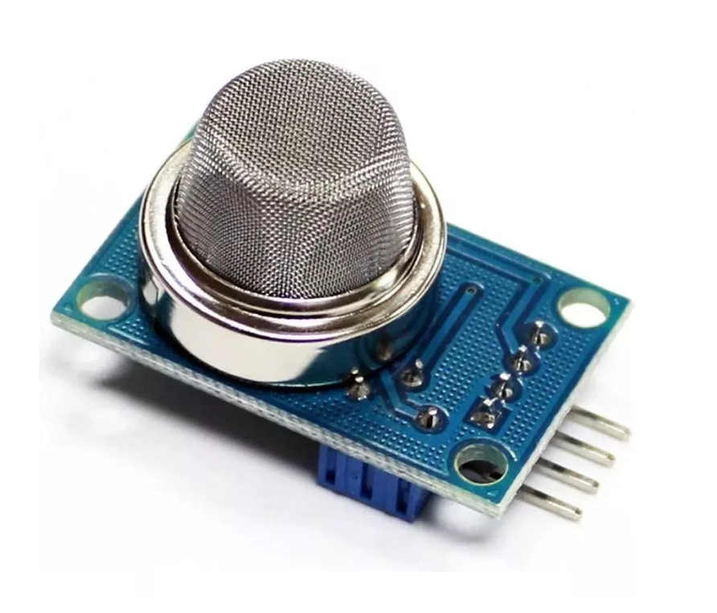
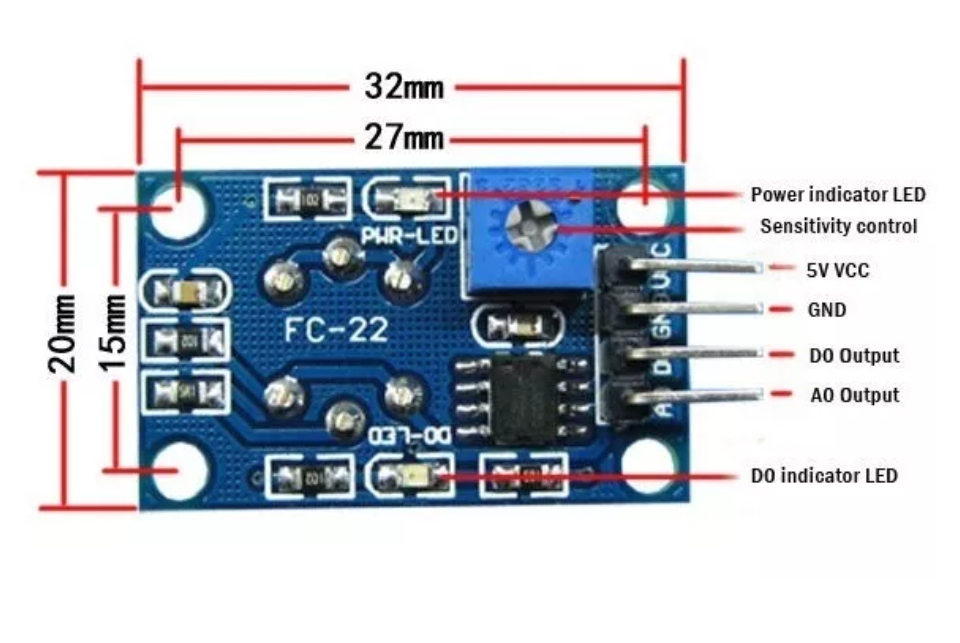
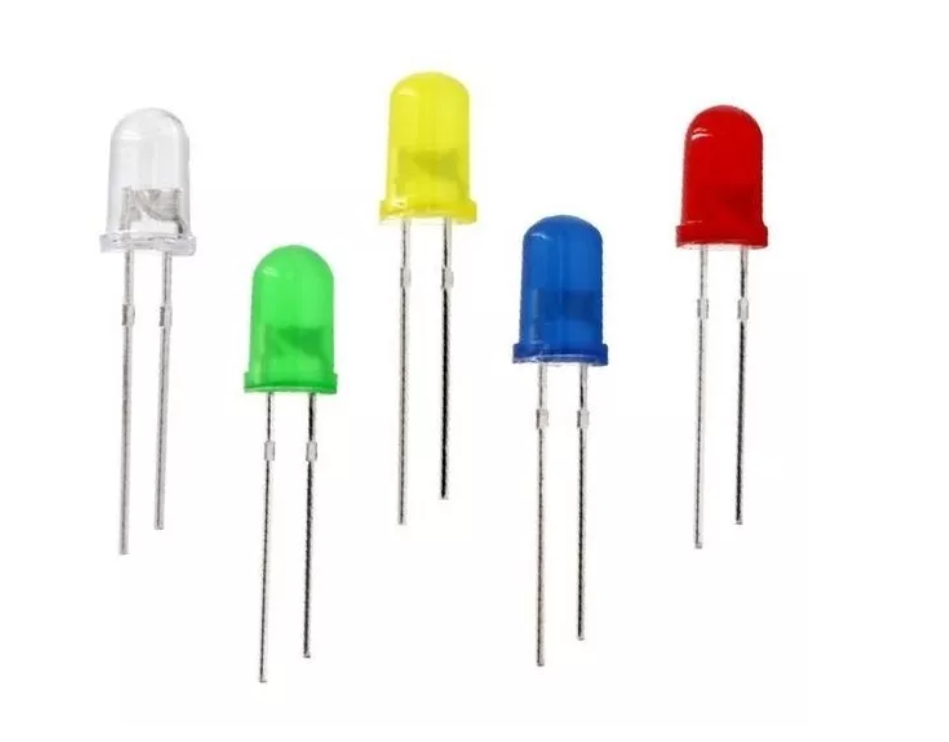

# applied-iot-airquality

This is a simple IoT project using the MQ-135 gas sensor module as well as the DHT22 temperature and humidity sensor to collect some interesting qualities of the surrounding air.

# Tutorial Report Template

**Please keep the total length of the tutorial below 25k characters.** You can include code that is linked to a repository. Keep the code snippets in the tutorial short.

## Tutorial on how to build a temperature and humidity sensor

## Title: Humidity and Temperature Station

### Name & Student Credentials

Andrea Viola Caroline Åkesson

ca223pw

### Short Project Overview

I built a web thing that measures the temperature and humidity of its surroundings, when humidity reaches over a beyond sweaty level a red LED lamp will turn on. You can also control the microcontrollers onboard LED via the MQTT brokers UI.

### Estimated Time to Complete Project

2 ?????????????????????? working days, with some time for the unexpected stuff life (read: software) throws at you.

### Objective

#### **Why did I choose this project?**

I chose this project because I found it interesting to see what was in the air of our apartment along with temperature and humidity, however, the MQ135 sensor is quite complicated and there is a need for calibration to see actual values of gases around. I'm using the digital output only, which is more of a yes/no if it detects gas or not.

#### **What purpose does it serve?**

With the DHT22 I measure the temperature and humidity of my island home at Isla Mujeres, Mexico. I also use the MQ135 sensor to detect gases such as NH3, NOx, Alcohol, Benzene, Smoke and CO2

#### **What insights will it give?**

How very, very hot the summer months here in the carribean really is. 

Jokes aside, purely data wise I had no idea that it was so much more humid here than Sweden, more than the double at over 70% compared to some of the measurements done by fellow students back home. 

Also aside from what the project itself does and collects data about - it has given me insights into electrical circuits and components used for minor IoT projects, along with protocols and how parts interact with each other. From firmware being installed on Pico, to code uploaded on the Pico and then connectivity with wifi to get the data over to Adafruit.

### Material

Explain all material that is needed. All sensors, where you bought them and their specifications. Please also provide pictures of what you have bought and are using.


| IoT Thing | Specification    |  Bought via      | Price        |
| --------- | ---------------- | ---------------- | ---------------- |
| Raspberry Pi Pico W  | With headers, RP2040 processor  | Amazon   | 150kr |  
| Breadboard  | 830 points | Amazon   | 45kr |
| Female/Male Jumperwires | 30cm | Amazon | 30kr |       
| Male/Male Jumperwires | 30cm | Amazon  | Free  |  
| Resistors        | 10 pcs, 1W, 10kohm | Mercado Libre   | 30kr | 
| DHT22            | Humidity & Temperature sensor | Amazon  | 120kr |
| MQ-135           | Air Quality sensor detecting smoke, amoniac, alcohol etc. | Mercado Libre | 40kr |
| LED light        | 100 LED's, 5mm, 80mcd, 2.1v | Mercado Libre | 80kr |

#### **Raspberry Pi Pico W**

I am using the Raspberry Pi Pico W which is an affordable, wireless-enabled microcontroller board. It offers GPIO pins, programmability in C/C++ & MicroPython, and supports various interfaces (ex. SPI, 12C, UART). It is compact and offer wireless connectivity, power efficiency, and community support (RP2040 Raspberry Pi community) making it a good choice for a wide range of IoT applications, from home automation and sensor monitoring to remote control projects etc.



#### **Breadboard 830 points**

I opted for an 830-point breadboard as a physical base for my project. It offers ample space, compatibility and is affordable. It accommodates my numerous components and simplifies the circuit connections.



#### **Male/Male Jumper Wires**

I work with Male-to-male jumper wires which have connectors at both ends, allowing to establish quick and temporary connections between components on the breadboard or between pins. They are versatile, flexible, and simplify circuit building, making them ideal for rapid prototyping, experimenting, and connecting components without soldering or permanent connections.



#### **10kohm Resistors**

For the DHT22 sensor a resistor between 4.7-10kohm was recommended for communication between the sensor and microcontroller. It sets the default voltage level when the data line is not actively transmitting data and ensures reliable signal transmission and accurate readings.



#### **DHT22 Sensor**

I am working with the DHT22 sensor that measures temperature and humidity. It provides accurate, reliable readings and is easy to use with microcontrollers making it suitable for applications such as home automation, weather stations, and environmental monitoring.



#### **MQ135 Sensor (front)**

I am also using the MQ135 sensor that detects various gases, including air quality parameters like CO2, NH3, and harmful substances. It can monitor indoor air quality, pollution levels, and gas leakage ensuring safe and healthy living environments. It would need to be calibered properly to see real amounts of gases, I merely use it as Yes/No detects some gas.



#### **MQ135 Sensor (back)**



#### **LEDs**

LEDs allows for visual feedback, status indicators and creative lighting effects leading to a visually appealing experience and user interaction. They are very energy efficient, semiconducting (made of materials inbetween that of conductors and insulators) devices emiting light when electric current passes through them.




### Computer setup

How is the device programmed? Which IDE are you using? Describe all steps from flashing the firmware to installing plugins in your favorite editor and how flashing is done on MicroPython. The aim is that a beginner should be able to understand.

#### **Chosen IDE**

For this project I have chosen to use Visual Studio Code as my Integrated Development Environment. I have this IDE installed on my computer since before, but if you don't you can download it from here: https://code.visualstudio.com/download

#### **Flashing Pico**

If the Pico W is new it will need the micropython firmware installed on it.

Download the UF2 file from here: https://micropython.org/download/rp2-pico-w/

You can then proceed to press the onboard bootsel button (placing the Pico W in download mode) while connecting the microcontroller to the computer. When the drive/file explorer (RPI-RP2) opens you can release the bootsel button and drag and drop the previously downloaded UF2 file onto the RPI-RP2, upon which the Pico will reboot and now run micropython

#### **Extensions**

To interact with the Pico I am using the extension "Pymakr" which you can find by searching for it under the "Extensions" tab on the left hand side of VSCode:


#### **How the code is uploaded**

To be able to actually run the code you write in VSCode you need to upload it to the Pico W first.
This extensions simplifies the development and provides several tools like a user friendly means to manage the device connection, uploading the project to the Pico and access to a REPL console. It will show up on the left hand side of your VSCode like such:


Whilst having your device connected to the computer via USB, click on the symbol for Pymakr shown above and a new tab will show. If you hover over the specific serial usb port there is a symbol in the form of a lightning which says "Connect device" - go ahead and press it. You will then connect to the Pico and can now upload you project or run/stop your script directly via the VSCode UI:


You can then create a REPL terminal by pressing the play button shown below and the main script should run automatically - if not, use execfile("main.py") as visible in the screenshot.


To stop the script you either press ctrl C in the REPL or press the 3 dots in the photo above and select "Stop script"

#### **Steps that you needed to do for your computer. Installation of Node.js, extra drivers, etc.**


### Putting everything together

How is all the electronics connected? Describe all the wiring. Good if you can show a circuit diagram. Be specific on how to connect everything and what to think of in terms of resistors, current, and voltage. Is this only for a development setup, or could it be used in production?

To put everything together I am using my 830 point breadboard as a base to facilitate and to make everything more stable. 

On one side I have pushed down the Pico W and on the other I have the two sensors that I am using and two LED's.


#### **Circuit Diagram**


#### **Electrical Calculations**

Since my LED's operate on 2.1V and my Pico W on 3.3V I need to "drop" 1.2V. It can be done using resistors, to calculate the resistance I need I can use Ohm's law. You then take: 

Voltage Source 3.3 - Voltage LED 2.1 
= 1.2

1.2 / 0.02 (20 milliamps)
= **60**

A resistor of 60ohms would be perfect. Unfortunately, I, at the time of this project only possessed 10kohm which ultimately made the LED emit only a tiny bit of light. I had many LED's to spare and simply wanted to see what happened if I connect it without a resistor. It worked fine so I let it be as such.

### Platform

Describe your choice of platform. If you have tried different platforms, it can be good to provide a comparison.

Is your platform based on a local installation or a cloud? Do you plan to use a paid subscription or a free one? Describe the alternatives going forward if you want to scale your idea.

- [ ] Describe platform in terms of functionality
- [ ] *Explain and elaborate on what made you choose this platform

#### **Adafruit**

I'm using Adafruit to display the data collected by the Pico. It is a cloud service and I have set up what they call a Group, which is a group of feeds representing the different datas/objects it receives/send data from/to (temperature, humidity, airquality, LED). By using a group it let's me send the data as one json object with an inner field of "feeds" which has key value pairs representing the specific feed for that kind of data i.e. "Temperature": tempData, etc. The version im using is free and I intend to keep it that way since it is enough for what I want to do. Payed versions would offer the ability to have more groups, feeds and dashboards etc. Scaling the idea could involve Adafruits integration with other platforms such as IFTT (If This Then That) to automate actions based on the data collected.

#### **Own implemented API and dotnet Blazor frontend**

### The code

Import core functions of your code here, and don't forget to explain what you have done! Do not put too much code here. Focus on the core functionalities. Have you done a specific function that does a calculation, or are you using a clever function for sending data on two networks? Or, are you checking if the value is reasonable, etc.? Explain what you have done, including the setup of the network, wireless, libraries and all that is needed to understand.

#### **Connecting to WIFI**

I connect to my local WIFI via the boot.py file which is run automatically on th Pico W's boot up (when starting). Typically, you would place any kind of logic or config needed to successfully run your main, therefor you can allow it to handle your network configuration.

Inside the function, it first checks if the device is already connected to a network. 
If not, it proceeds with the connection process.
It activates the Wi-Fi interface and attempts to connect to the specified network using the provided SSID and password.
While the device is not connected to the network, it repeatedly tries to connect with a one-second delay between attempts to give some time for the process before checking the connection status again.
Once the device is successfully connected, it prints a message confirming the connection and displays the network configuration details.

boot.py:

```
import network, time
from env_variables import ENV_VARIABLES 

def connect(SSID, SSID_PASSWORD):
    sta_if = network.WLAN(network.STA_IF)
    if not sta_if.isconnected():
        print('Connecting to network...')
        sta_if.active(True)
        sta_if.connect(SSID, SSID_PASSWORD)
        while not sta_if.isconnected():
            print("Attempting to connect....")
            time.sleep(1)
    print('Connected! Network config:', sta_if.ifconfig())

connect(ENV_VARIABLES['SSID'], ENV_VARIABLES['SSID_PASSWORD'])

```

#### **Send data to group on Adafruit**

Due to having all relevant feeds in the same group on Adafruit I can send the data as one single object with an inner field of "feeds". Adafruit will then use each key in the object and match it to the corresponding feed in the group on the platform - instead of having to send it separately.

```
    if (time.time() - last_publish) >= publish_interval:
        sensorData = {
            'feeds': {
                'Temperature': temp,
                'Humidity': humidity,
                'Airquality': digital_air_quality_value
            }
        }

        payload = json.dumps(sensorData)
        
        mqttClient.publish(TOPIC_TEMP_HUMIDITY_AIRQUALITY_LED, payload.encode())
        
        last_publish = time.time()
        print('Published!')

```

### Transmitting the Data / Connectivity

How is the data transmitted to the internet or local server? Describe the package format. All the different steps that are needed in getting the data to your end-point. Explain both the code and choice of wireless protocols and API information models, if any.

#### **How often is the data sent?**

The data is published to Adafruit every 5 seconds (there seems to be a slight latency at times).

#### **Which wireless protocols did you use (WiFi, LoRa, etc ...)?**

I am using WiFi.

#### **Which transport protocols were used (MQTT, webhook, etc ...)**

I am using the MQTT protocol to transfer the data to Adafruit. I originally tried to transfer the data using JSON over HTTP to my own built dotnet API, however the Pico W

#### **Which information models were used (WoT TD, Fiware,** etc...)

Im not using an information model.

#### ***Elaborate on the design choices regarding data transmission and wireless protocols. That is how your choices affect the device range and battery consumption.**

### Presenting the data

#### **Provide visual examples of how the dashboard looks. Pictures needed.**


Below you can see a screenshot of the Adafruit dashboard I created.


#### **How often is data saved in the database.**

I publish the data to Adafruit every 5 seconds, meaning 12 times per minute. The rate limit for the free plan that Adafruit offers is 30 per minute and after that you would receive a throttle warning. The data is saved each time it is published together with a timestamp of that moment..

#### ***Explain your choice of database.**

I personally have not set up a database. Adafruit saves the data for 30 days and you can also download the data if you want

#### ***Automation/triggers of the data.**

### Finalizing the design

#### **Show the final results of the project**

This was quite a journey! It did not fully turn out as I hoped.

When I started out the project I originally planned to use the ELK stack. I did install Logstash, Elastic Search and Kibana, it was all up and running after the initial installation, but whenever I would shut down for the day - the next day Kibana would be upset and refuse to connect to Elastic (error: "Unable to retrieve version information from Elasticsearch nodes"). I then deleted and reinstalled Kibana upon which it worked - until I would shut it down and try to access it again. After countless of hours trying to fix the issue through the config files I had to admit defeat and the fact that this problem was beyond me.

I then got the idea of setting up my own API and dashboard to handle and visualize the data! Something I got really excited about because I planned to try out a new programming language, namely dotnet, both for API and frontend. I set up the API and successfully made requests via Postman and stored the data in Elastic. Since the Pico and my computer are different entities I could not use localhost and therefor set up a tunnel with serveo.net for the Pico to be able to reach my API. Unfortunately, when trying to make these requests from the Pico to post the real data collected by it, the Pico program would crash with an ENOMEM and I have not been able to solve the issue. I created a fake endpoint via RequestBin to see if it was rather my API that was the problem (although it has been working fine with Postman), I first only sent temperature data to the fake endpoint - that worked, BUT I then tried sending temperature, humidity and airquality (3 requests) to the fake endpoint and then - ENOMEM. I then tried to send only temperature data to my own API, but it seemed the Pico was already upset and now I did not manage to even send a single request neither to my API nor the fake endpoint. This makes me believe that it indeed has something to do with the memory, but during a help session it was me and several TA's trying to solve it without success.

So, when the final week before hand-in layed before me I set up the Adafruit account and dashboard instead. I am dissappointed that the way I tried to challenge myself did not pay off, but Adafruit did the trick and I could at least have a finished solution to submit.

#### **Pictures**


#### **Video presentation of the project**
